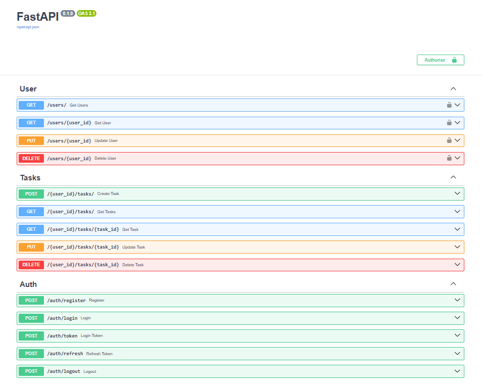

# 📌 Project TODO




An educational task management service with user system.  
Allows users to register, log in, and manage their tasks with automatic deadlines.

## 🚀 Features

- User registration and authentication (JWT + cookies).
- CRUD for users.
- CRUD for tasks.
- Deadlines are automatically set for tasks.
- API documentation via Swagger (`/docs`).

---

## ⚙️ Installation & Run

### 🔹 1. Clone the repository

```bash
git clone https://github.com/vialex287/todo_project.git
cd todo_project
```

### 🔹 2. Run with Poetry
```bash
poetry install --with dev
cp .env.example .env
poetry run uvicorn main:app --reload
```

### 🔹 3. Run with Docker
```bash
docker build -t todo_project .
docker run -p 8000:8000 todo_project
```

---

## 🛢️ Database

- Default database: MySQL.

- For tests: SQLite (faster).

- Alembic is included, but currently the app wipes database data on startup.

---

## 📂 Project Structure
```bash
app/
├── core/          # Configs and settings
├── models/        # SQLAlchemy models
├── routers/       # API routers (auth, users, tasks)
├── services/      # Business logic
└── main.py        # App entrypoint

```
---

## 🔑 Main Endpoints

### User/Admin Operations
👤 User:
- Create / Read / Update / Delete **own tasks**
- Manage deadlines automatically set for tasks

👤 Admin:
- Get list of users
- Get user by ID
- Update user
- Delete user

### CRUDS
#### 🔹 Authentication

- POST /auth/register — register a new user.

- POST /auth/login — login.

- POST /auth/token — login with form-data.

- POST /auth/refresh — refresh token.

- POST /auth/logout — logout.

#### 🔹 Users

- GET /users/ — get all users.

- GET /users/{id} — get user by ID.

- PUT /users/{id} — update user.

- DELETE /users/{id} — delete user.

#### 🔹 Tasks

- POST /tasks/ — create a task.

- GET /tasks/ — get user tasks.

- GET /tasks/{id} — get a task by ID.

- PUT /tasks/{id} — update a task.

- DELETE /tasks/{id} — delete a task.

---

## 🧪 Tests
```bash
poetry run pytest --cov=app --cov-report=term-missing

```

---

## 📖 Tech Stack

- [FastAPI](https://fastapi.tiangolo.com/)

- [SQLAlchemy](https://www.sqlalchemy.org/)

- [Alembic](https://alembic.sqlalchemy.org/)

- [Pydantic](https://docs.pydantic.dev/)

- [Poetry](https://python-poetry.org/)

- [Docker](https://www.docker.com/)

---

## 📜LICENSE

 [MIT](./LICENSE)

---
